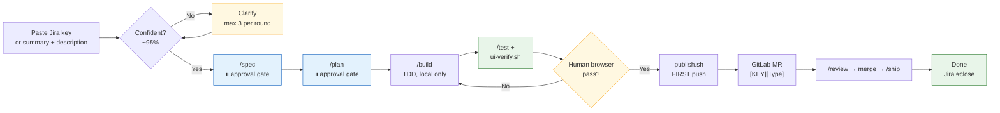
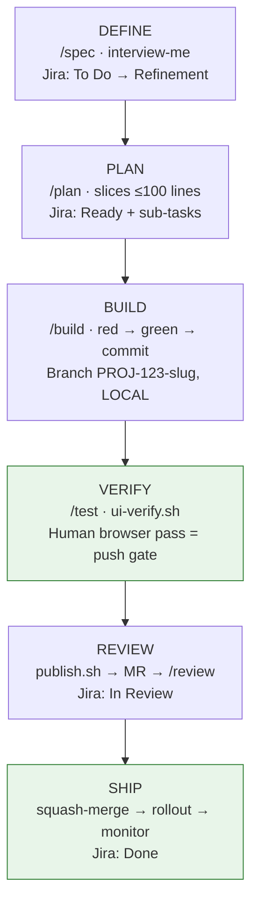
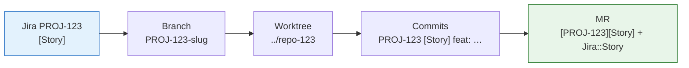

# SDLC Workflow — Paste a Jira Key, Get a Merged MR

[](LICENSE)
[](https://github.com/aniketshukla1/sdlc-workflow/pulls)
[](skills/)
[](https://github.com/aniketshukla1/sdlc-workflow#supported-agents)
[](https://github.com/aniketshukla1/sdlc-workflow)

**One skill that takes a Jira issue end to end — clarify, branch, spec, plan, build, verify, publish, open the MR — in any coding agent, with human gates where judgment matters and automation everywhere else.**

Built on [addyosmani/agent-skills](https://github.com/addyosmani/agent-skills) (25 engineering skills) plus this pack's own `jira-autopilot` orchestrator and `mr-review` gate. Trunk-based. Jira-tracked. Nothing reaches origin before your browser says so.

**Stack:** Python FastAPI (backend) · React + Tailwind + shadcn/ui (frontend) · docker-compose
**Flow:** Jira (tracking) · GitLab (SCM + CI/CD) · any agent (Claude Code, Codex, Cursor, OpenCode, Gemini, Copilot, Kiro, Windsurf, Antigravity, +70 via `npx skills`)

> New teammate? Start here: [`docs/teammate-onboarding.md`](docs/teammate-onboarding.md) — setup, first-issue walkthrough, daily loop, troubleshooting.

## How it feels

```text
you:   /autopilot PROJ-123
agent: Mode A · PROJ-123 [Story] user-login — fetched from Jira.
       ASSUMPTIONS I'M MAKING:
       1. OAuth only (no password login in this slice)…
       → Correct me now or I'll proceed after your answers.
you:   drop 2, keep 1 and 3 — proceed
agent: ✓ Branch PROJ-123-user-login (local only)
       ✓ SPEC-PROJ-123.md — waiting for your approval…   ⏸ YOU
       ✓ tasks/PROJ-123-plan.md — 4 slices — approved…   ⏸ YOU
       ✓ 4/4 slices green (pytest + vitest + eslint) — app is up at :8000/:3000
       → test in your browser now…                       ⏸ YOU (push gate)
you:   UI passes — ship it
agent: ✓ Pushed (first push) → MR [PROJ-123][Story] User login opened
       → https://gitlab.com/…/merge_requests/42 · Jira → In Review
```

Three human pauses. Zero copy-paste. Everything else is the agent.

## The autopilot flow



Small Bug/Task fix (≤2 files, no migration/auth/API change)? The **fast lane** skips
the blue gates entirely: `/fix` runs clarify → branch → failing-test-first fix →
suite green → publish → MR, no pauses. The agent picks the lane from the issue;
you can override with `/fix` or by saying so.

## Lifecycle phase gates



Full gate-by-gate definition: [`SDLC.md`](SDLC.md). Detailed 12-step chart: [`docs/sdlc-flow.mmd`](docs/sdlc-flow.mmd).
Branching + parallel-work policy: [`docs/branching-and-mr-policy.md`](docs/branching-and-mr-policy.md).
Jira↔GitLab wiring (MCP-first + token fallback): [`docs/jira-gitlab-integration.md`](docs/jira-gitlab-integration.md).

## One issue, one branch, one MR



- **Branch:** `PROJ-123-short-summary` (Jira key first, no `feat/` prefix, 1–3 day lifetime)
- **Commits:** `PROJ-123 [Type] <feat|fix|refactor|test|docs|chore>: …` — atomic, tests green before commit
- **MR:** `[PROJ-123][Type] Summary` + `Jira::` label + filled template (Jira link, spec section, test evidence, rollback)
- **Spec before code; tests before implementation.** Every AC-ID maps to ≥1 failing-first test. Backend ≥80% touched + zero new uncovered lines; e2e + axe on UI MRs.

## Why this pack

| Problem with raw agents | What the workflow does |
|---|---|
| Skips specs, "prototype becomes product" | `/spec` gate — 6 areas + AC-IDs, human approval before planning |
| Vague tasks balloon in scope | Clarify-to-95% protocol, assumptions on record, one issue = one MR |
| Pushes half-tested code | Local-only loop; first push is `publish.sh` **after** your browser pass |
| Reviews rubber-stamp green pipelines | `/mr-review` — Jira-AC traceability table + five-axis gates + posted verdict |
| Works in one IDE only | Same `AGENTS.md` + `skills/` in 10 agents' native paths (table below) |
| Tokens and secrets leak into prompts | MCP-first with token fallback; hygiene enforced by the skill, not memory |

## Install (pick your agent)

Upstream engineering skills come from `addyosmani/agent-skills`; this pack adds `jira-autopilot` + `mr-review`.
Full step-by-step guide (prerequisites, verify, troubleshooting): [`docs/installation.md`](docs/installation.md).

Pick **ONE** of the three options below. Option 1 needs no clone (runs from anywhere);
options 2–3 run from a local clone, so start with:

```bash
git clone https://github.com/aniketshukla1/sdlc-workflow.git && cd sdlc-workflow
```

1. **Skills only, 1 minute** — the two skills in your current agent, nothing else:
   ```bash
   npx skills add aniketshukla1/sdlc-workflow
   ```
2. **Full workflow (recommended)** — skills *and* executors (`scripts/`, `templates/`, routers).
   It asks scope (global / current project / custom path), agents, then project paths:
   ```bash
   ./scripts/install-workflow.sh
   # Non-interactive: --scope global|project --project ~/my-app --agents cursor,opencode --yes
   ```
3. **Skills sync only** — the 25 upstream skills + this pack into all 7 skill dirs:
   ```bash
   ./scripts/install-skills.sh --all
   # Or subset: ./scripts/install-skills.sh --skills spec-driven-development,test-driven-development,code-review-and-quality
   ```

Global installs the skills; each project you name also gets the executors.
After installing, restart your agent session so it discovers the new skills.

| Agent | Skills | Commands | Notes |
|---|---|---|---|
| Claude Code | `.claude/skills/` (via install script) | `.claude/commands/` + marketplace `.claude-plugin/` | `/plugin marketplace add aniketshukla1/sdlc-workflow` |
| Codex | `./skills/` in place (`.codex-plugin/`) | `@jira-autopilot`, `@mr-review` | `codex plugin marketplace add aniketshukla1/sdlc-workflow` (CLI v0.122+) |
| Cursor | `.cursor/skills/` | `.cursor/rules/` + auto-routing | Never paste full skills into rules |
| OpenCode | `.opencode/skills/` | `.opencode/commands/` | `skill({name})` routing via `AGENTS.md` |
| Gemini CLI | `.gemini/skills/`, `.agents/skills/` | `.gemini/commands/*.toml` | `gemini skills install aniketshukla1/sdlc-workflow --path skills` |
| GitHub Copilot | `.github/skills/`, `.agents/skills/` | `.github/copilot-instructions.md` | `npx skills add` supported |
| Kiro | `.kiro/skills/` | auto-discovered | Follows `AGENTS.md` |
| Windsurf | via `.windsurfrules` | `commands/*.toml` reference | Keep global rules to 2–3 skills |
| Antigravity | `./skills/` + `plugin.json` | `commands/*.toml` | `agy plugin install https://github.com/aniketshukla1/sdlc-workflow.git` |
| Command Code / others | `./skills/` directly | `AGENTS.md` | `cmd skills add aniketshukla1/sdlc-workflow` |

> Skills activate automatically too (API design → `api-and-interface-design`, UI → `frontend-ui-engineering`, etc.). Explicit commands are the deterministic path — auto-routing is the fallback. Never load all 25 skills as always-on context; load by phase.

## Quick start (per project)

```bash
# 1. Copy this template into your repo root (or clone it as starter)
cp -r /path/to/sdlc-workflow/.cursor /path/to/sdlc-workflow/AGENTS.md /path/to/my-project/
cp -r /path/to/sdlc-workflow/.opencode /path/to/my-project/
cp -r /path/to/sdlc-workflow/.claude /path/to/my-project/          # Claude Code commands
cp -r /path/to/sdlc-workflow/.gemini /path/to/sdlc-workflow/commands /path/to/my-project/  # Gemini / Antigravity
cp -r /path/to/sdlc-workflow/.codex-plugin /path/to/sdlc-workflow/.agents /path/to/my-project/  # Codex
cp /path/to/sdlc-workflow/CONSTRAINTS.md.example /path/to/my-project/CONSTRAINTS.md

# 2. Wire GitLab templates + local hooks (one time per project)
# GitLab → Settings → Merge Requests → Default MR template, paste templates/gitlab/merge_request_template.md
# Copy templates/gitlab/.gitlab-ci.yml.example → .gitlab-ci.yml and adjust image/vars
# Install pre-commit: cp templates/git-hooks/pre-commit.example .git/hooks/pre-commit && chmod +x .git/hooks/pre-commit

# 3. Paste a Jira key and go — /autopilot picks the lane by the issue
/autopilot     # small Bug/Task (≤2 files, no risk) → fast lane: test-first fix → MR, no pauses
               # anything bigger → full lane: pauses for spec, plan, and browser UI pass
# Small fix and in a hurry? /fix jumps straight to the fast lane.

# Manual path (same gates, you invoke each step):
/constraints   # once per project → writes CONSTRAINTS.md
./scripts/new-issue.sh PROJ-123 Story short-summary  # branch PROJ-123-summary + worktree (LOCAL ONLY)
/spec          # per Jira Epic/Story → writes SPEC-<KEY>.md, link in Jira (asks questions first)
/plan          # per spec → writes tasks/plan.md + Jira sub-tasks
/build         # per sub-task on the PROJ-123-summary worktree (or /build auto) — commits stay LOCAL
/test          # reproduce → fix → guard (local)
./scripts/ui-verify.sh  # boot + URLs → you test in browser on SAME branch, NOTHING on origin yet
# UI fails → back to /build (still local). UI passes ↓
./scripts/publish.sh     # FIRST push to origin (conventions check + push)
/review        # 5-axis + security + perf → MR [PROJ-123][Type] auto-filled → approve in GitLab → /ship
# Reviewing a colleague's MR? /mr-review — Jira-AC traceability + hard gates + verdict, posted to the MR
```

Truly automated: after plan approval, agents work locally to a browser-testable state; NOTHING reaches origin before your local UI pass. Details: `docs/automation-and-ui-verification.md`. Unsure handling: `docs/clarification-protocol.md` (agent must ask, never guess). Graphs/tests: `docs/code-graph-and-test-stack.md` (Graphify + pytest/vitest/playwright/axe).

## What's inside

<details>
<summary>Repo layout (click to expand)</summary>

```
.
├── AGENTS.md                        # Shared router — read by every agent
├── CLAUDE.md / GEMINI.md            # Thin pointers for Claude Code / Gemini CLI
├── .windsurfrules                   # Thin router for Windsurf
├── SDLC.md                          # Phase gates, entry/exit, skill mapping
├── CONSTRAINTS.md.example           # Quality bar defaults (copy to CONSTRAINTS.md per project)
├── skills/                          # This pack's own skills (jira-autopilot, mr-review) — portable core
├── .cursor/
│   ├── rules/                       # Thin routing policies (never full skills)
│   └── skills/                      # Installed via script (gitignored, synced from upstream)
├── .opencode/
│   └── commands/                    # /autopilot /fix /spec /plan /build /test /review /mr-review /ship wrappers
├── .claude/commands/                # Same wrappers for Claude Code (marketplace: .claude-plugin/)
├── .gemini/commands/                # Same wrappers as TOML for Gemini CLI
├── commands/                        # Same wrappers as TOML for Antigravity (manifest: plugin.json)
├── .codex-plugin/ + .agents/plugins/# Codex marketplace manifests (Codex reads ./skills/ in place)
├── .github/
│   ├── copilot-instructions.md      # Router for GitHub Copilot
│   └── skills/                      # Installed via script (gitignored)
├── .kiro/skills/                    # Installed via script (gitignored)
├── .agents/skills/                  # Generic discovery path (gitignored)
├── templates/
│   ├── adr/                         # Architecture Decision Records (copy to docs/adr/NNNN-*.md)
│   ├── jira/                        # Story / Bug / Task / Sub-task / Flaky-test bodies
│   ├── gitlab/
│   │   ├── merge_request_template.md
│   │   └── .gitlab-ci.yml.example   # Stages mapped to skill gates (+ coverage/contract)
│   ├── git-hooks/
│   │   └── pre-commit.example       # Fast local gates (install to .git/hooks/)
│   ├── frontend/
│   │   ├── lighthouserc.cjs.example  # LHCI budgets (copy to frontend/lighthouserc.cjs)
│   │   └── Button.stories.tsx.example # Storybook story pattern (copy next to component)
│   ├── renovate/
│   │   └── renovate.json.example    # Dependency updates (copy to renovate.json at root)
│   └── spec/                        # SPEC.md + tasks/plan.md starters (AC-IDs + TDD-first)
├── scripts/
│   ├── install-skills.sh            # One-command skill install for every agent (upstream + this pack)
│   ├── new-issue.sh                 # PROJ-123-summary branch + worktree (LOCAL ONLY, no push)
│   ├── check-jira-conventions.sh    # Branch/commit/MR lint (also a CI job)
│   ├── ui-verify.sh                 # Compose up + health wait + URLs (the push gate)
│   └── publish.sh                   # FIRST push to origin, only after local UI pass
├── docs/
│   ├── teammate-onboarding.md       # START HERE: setup + first issue + daily loop
│   ├── clarification-protocol.md    # Ask-when-unsure rules (mandatory)
│   ├── automation-and-ui-verification.md  # Truly automated loop, UI-only human gate
│   ├── code-graph-and-test-stack.md # Graphify + pytest/vitest/playwright/axe guide
│   ├── spec-to-tdd-and-coverage.md  # Spec AC → failing test → green → coverage gates (core)
│   ├── ui-ux-testing.md             # 6-layer UI system: roles, tokens, axe, snapshots, e2e, LHCI
│   ├── storybook.md                 # Component catalog: setup, story rules, test-runner path
│   ├── flaky-test-triage.md         # Quarantine ritual: owner + expiry + weekly review
│   ├── migration-safety.md          # Expand/contract + reversible migrations (CI-proven)
│   ├── review-apps-plan.md          # PLAN: per-MR preview envs (not implemented yet)
│   └── renovate.md                  # Dependency-update bot setup (schedules, automerge, tokens)
└── references/                      # Shared checklists (see script)
```

</details>

## Conventions (non-negotiable)

- **One Jira issue = one branch = one worktree = one MR.** Branch: `PROJ-123-short-summary` (Jira key first, no feat/ prefix, e.g. `PROJ-123-user-login`). See `docs/branching-and-mr-policy.md`.
- **Commits:** `PROJ-123 [Type] <conventional-type>: ...` (e.g. `PROJ-123 [Story] feat: ...`, `PROJ-123 [Bug] fix: ...`). `[Type]` = Jira issue type. Atomic, ~100 lines, tests pass before commit.
- **MR title:** `[PROJ-123][Type] Summary` + label `Jira::Story|Bug|Task`. Description = Jira link + type + spec section + tests + checklist (template enforced).
- **Spec before code; tests before implementation.** Every spec AC has an ID traced to ≥1 failing-first test (`docs/spec-to-tdd-and-coverage.md`). Coverage: backend ≥80% touched + zero new uncovered lines, frontend vitest thresholds, e2e + axe on UI MRs. Mutation: mutmut zero-survived on high-risk backend modules.
- **Definition of Done** = task acceptance criteria **plus** standing checklist (`references/definition-of-done.md`).
- **CODEOWNERS:** sensitive paths (auth, migrations, billing, CI) need named human approval — copy `templates/gitlab/CODEOWNERS.example` → `CODEOWNERS` at project root and replace the handles.

## Upstream & license

- Skills source: [`addyosmani/agent-skills`](https://github.com/addyosmani/agent-skills) (`skills/`, `references/`, `agents/`) — MIT.
- Per-skill installs omit repo-level `references/` (upstream [#361](https://github.com/addyosmani/agent-skills/issues/361)) — `install-skills.sh` copies `references/` alongside to fix this.
- Do NOT copy upstream root `AGENTS.md`/`CLAUDE.md` — those configure the skills repo itself. This template's `AGENTS.md` is yours.
- This pack is MIT — see [LICENSE](LICENSE). Star it, fork it, `npx skills add aniketshukla1/sdlc-workflow` it. PRs welcome.
